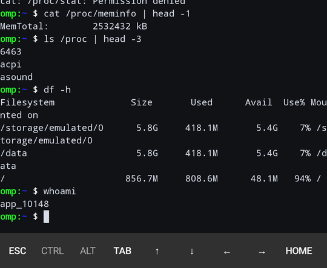

<h1 align="center">omp terminal</h1>

<p align="center">A real terminal for your Android phone, written in Kotlin.</p>

<p align="center">
  
</p>

---

## What it is

A terminal emulator for Android where you can explore your own device with the commands you
already know:

```
ls  cat  grep  find  sed  du  tree  zip  wc  sort  zipgrep …
df  ps  top  free  uname  getprop  pm  am  dumpsys  settings  wm  screencap  curl
```

It is not a wrapper around toybox. The shell — the lexer, parser, expander, line editor and the
terminal emulator itself — is written from scratch in Kotlin. **There is no root, no NDK, no
bundled binary and no `Runtime.exec`.** Every command is Kotlin code running inside your app's
own sandbox.

```
$ ls /proc | head -3
6263
acpi
asound

$ cat /proc/stat
cat: /proc/stat: Permission denied

$ cat /proc/meminfo | head -1
MemTotal:         2532432 kB
```

That asymmetry is the point of the app. Android closes most of `/proc` to ordinary apps, and this
shell tells you so instead of making something up.

## Build it

You need JDK 21 and an Android SDK with platform 35.

```bash
export ANDROID_HOME="$HOME/Android/Sdk"
echo "sdk.dir=$ANDROID_HOME" > local.properties

./gradlew :app:assembleDebug     # app/build/outputs/apk/debug/app-debug.apk
./gradlew :core:test             # 575 tests: the shell's whole behaviour, on the JVM, in about half a minute
```

## Use it

Type a command and press Enter. The bar at the bottom is always there, so every key is one tap
away even if your keyboard eats it.

- **CTRL**, **ALT** arm a modifier for the next key — that is how Ctrl-C and Ctrl-L work without a
  hardware keyboard.
- **ESC**, **TAB**, arrows, **HOME**/**END**, **PGUP**/**PGDN** and the punctuation block are on the
  bar.
- **Long-press and drag** to select text; it goes to the clipboard. Drag vertically to scroll back.
- **Pinch** to change the text size.
- **Back** stops a running command; press it twice to exit. `Ctrl-D` on an empty line also exits.
- **Ctrl-C** cancels whatever is running.

- There is a second shell inside this one — see **The VM**, below.

### Some commands are deliberately missing

Android does not let an app do these things, and this shell would rather say why than pretend:

| not there | why |
|---|---|
| `chmod`, `chown` | need privileges an app does not have |
| `mount -o`, `lsblk` | `/proc/mounts` and `/sys/block` are closed to apps |
| `dmesg`, `logcat` | `READ_LOGS` is a signature-level permission |
| `netstat` | `/proc/net` is excluded from untrusted apps |
| `su`, `sudo`, `setprop` | nothing to escalate to |
| `settings put` | needs the signature-level `WRITE_SECURE_SETTINGS` |
| `ps` shows one process | other apps' `/proc/<pid>` is closed; yours is all there is |

`help` lists all of them with the same one-line reasons.

## The VM

There is a second shell inside this one. It is an **in-process userspace VM** — Ubuntu Server
24.04.1 LTS, minimal, running on a directory in the app's own storage. No image to download, no
kernel to boot, no native code, no `Runtime.exec`, and no root: every command in it is the same
Kotlin the phone shell runs, with a different `Vfs` behind it.

```
$ vm
vm: booted, Ubuntu 24.04.1 LTS, 1 process(es) in the pid namespace
disk: /data/user/0/com.omp.terminal/files/rootfs (32881 bytes on disk)
packages: 7 installed
  unit omp-vmd.service: active (running)
  unit systemd-journald.service: active (exited)
  unit vm-hostbridge.service: active (exited)
/mnt/android: bound to /storage/emulated/0
note: root inside the VM is a name the VM kernel answers to, not a privilege escalation on the
phone; the app's real uid is 10123 and it is in /sys/omp/android/uid
```

`vm enter` drops you into it on this terminal — same screen, same keyboard, prompt says `ubuntu` —
and `exit`, `Ctrl-D` or **Back** brings you back.

```
$ vm enter
ubuntu:~$ cat /etc/os-release
PRETTY_NAME="Ubuntu 24.04.1 LTS"
ID=ubuntu
ubuntu:~$ exit
back on the phone; the VM is still booted and still on disk
```

You also get `apt`, `dpkg`, `systemctl` and `journalctl`, which the phone shell deliberately does
not have, `/mnt/android`, which is a real bind onto the phone's shared storage, and `/mnt/omp`,
which is the conversations folder — one bind, one directory, and a file written in there is a file
under *Internal storage ▸ Documents*.

`vm exec 'uname -a'` runs one line in there and returns its status. `vm mounts` and `vm services`
print the mount table and the unit list. `vm reset` throws the whole rootfs away — and refuses to
without `--force`, after printing the directory and its size.

### What it is not

It is not a hypervisor, not QEMU, not an emulator and not a container. There is one process. There
is no second uid to escalate to and no memory isolation: `root` inside the VM is a **name the VM
kernel answers to**, which is why the real one is one `cat` away in `/sys/omp/android/uid`.
`docs/vm.md` has the design and the limits in full.

## Conversations

`omp` is what the app opens on, and it is the same command inside the VM as outside it — it asks
the session's own filesystem where the container is rather than being told.

**A conversation is one plain folder, and that folder is the project.** `omp new photos` makes
`Internal storage ▸ Documents ▸ omp/photos`, enters it, and puts both of its names in the
environment: `OMP_WORKSPACE` for the path commands take, `OMP_WORKSPACE_REAL` for the one a file
manager, a cable or another app needs. A folder renamed in the file manager is listed under its new
name, because the directory owns its name and the app only keeps the old one as history.

```
$ omp
conversations in /storage/emulated/0/Documents/omp  (/mnt/omp in the VM):
  #  name    modified          where
  1  photos  2026-09-27 03:08  /storage/emulated/0/Documents/omp/photos

type a number to continue, or n for a new one: 1
omp: in photos
  OMP_WORKSPACE=/storage/emulated/0/Documents/omp/photos
  OMP_WORKSPACE_REAL=/storage/emulated/0/Documents/omp/photos
```

### The agent

Inside a conversation, `omp` is not the launcher any more — it is the coding agent. The words that
mean something there are `omp` itself, `run`, `update`, `key` and `help`, plus `--yes` on `omp`.

```
$ omp new fotos
omp: created and in fotos
  OMP_WORKSPACE=/storage/emulated/0/Documents/omp/fotos
  OMP_WORKSPACE_REAL=/storage/emulated/0/Documents/omp/fotos

$ omp update && omp
omp agent 0.1.0
  folder:     /storage/emulated/0/Documents/omp/fotos
  provider:   openai
  endpoint:   https://api.openai.com/v1/chat/completions
  model:      gpt-4o-mini
  key:        /data/user/0/com.omp.terminal/files/agent/openai.key (43 bytes, never printed)
  transcript: …/fotos/.omp/transcript.jsonl — 0 entries, 0 of 8388608 bytes
  tools:      read_file, list_dir, search, write_file, edit_file — inside this conversation only
  writes:     every write_file and edit_file is put to the user first;
              'omp --yes' approves them all, and the transcript records it
  There is no run tool: the shell in this VM can 'vm reset' and throw away the namespace
  this conversation is in, and the model picks its own command lines. Use the file
  tools above; the user can run a command themselves.
  state:      written by this build
  this command does not download anything and cannot: the agent is Kotlin inside the app you are
  already running, so a newer agent is a newer build of this app
omp agent 0.1.0, in this conversation's folder:
  /storage/emulated/0/Documents/omp/fotos
omp[fotos] > what is in here?
```

**The folder is the conversation.** Every question and every answer is appended to
`.omp/transcript.jsonl` inside it, so the next `omp` in the same folder continues the exchange —
including one the user interrupted half way through, which is recorded as what had arrived.
`Ctrl-C` stops an answer, closes the stream and writes it down; `Ctrl-C` on an empty prompt leaves.

**A Ctrl-C on a stalled answer is a quarter of a second plus a second, and that is arithmetic
rather than a hope.** Nothing can interrupt a read already parked inside a socket, so the transport
sets a 250 ms read timeout as a *checkpoint* rather than a limit and looks at the clock and a cancel
flag every time it fires; the watchdog asks the shell's flag once a second and calls `close()`. So
the flag is issued within a second of the keystroke and acted on within a quarter of a second of
that. Five minutes of silence is the actual limit, and passing it ends the answer with the host
named and roughly how long it was quiet.

**The key is typed, never echoed and never shown.** `omp key` asks for it with the terminal's echo
off and puts it through `KeyStore`, in the app's private `files/agent/<provider>.key` — deliberately
outside the VM namespace and outside `Documents/omp`, so no path the agent can reach leads to it.
`omp key --show` names the provider, the file and a byte count; there is no code path from it to
the secret.

```
$ omp key                     # prompted, echo off
$ omp key --show              # provider, file, byte count
$ omp key --list              # every provider that has a key
$ omp key --forget openai     # exactly one
```

**The agent has five file tools, and they reach one folder.** `read_file`, `write_file`,
`edit_file`, `list_dir` and `search`, declared to the model with the description and the parameters
that are the model's only documentation of them. Everything they do goes through one class,
`omp.agent.tools.Sandbox`, and every path it is asked about is checked there and nowhere else: one
decision, one place, and no way to reach the filesystem from the agent without an answer from it.

**The boundary is this conversation's folder, and it is the strict answer.** The user permitted
`Documents/omp`; the agent was then given *one* conversation inside it, and the container above is
refused — **even for a read**, because listing somebody else's conversations is a capability it
was not given. Names are compared exactly: nothing folds case and nothing normalises Unicode, so
`Photos` and `photos` are not the same directory to a model that was not given either spelling.
A symlink is followed and its *target* is what is checked, the way the kernel does it. **A file on
the phone is not a sandbox boundary, and the app does not claim one**: this stops the accident — a
model that is confidently wrong about where it may write, a `..` that walked out of the folder —
and it is not a wall against a determined caller, which in this app would be Kotlin inside the app
the user already installed.

**The conversation's own `.omp` folder is inside the folder and is still not the model's.** The
transcript and the state file are refused — **for a write and for a read** — because a model that
can write `state.json` has the *next* request sent to a `base_url` of its own choosing, and a
model that can read the transcript is reading this conversation back in its own words. `list_dir`
still lists it as an entry, because it is a real folder the user can see in a file manager; asking
to go *into* it is what is answered, by the same class and in the same words.

**Every write is put to the user, one keypress at a time.** Before any `write_file` or `edit_file`
the agent prints the path, the same path as a file manager shows it, the size, and for an edit the
old and the new text. `y` goes ahead; anything else cancels that call and the model is told the user
declined. A Ctrl-C cancels the call and gives the terminal back. **`omp --yes` approves every call
in that turn without asking, and the transcript records `auto` rather than `y`** — so a folder read
afterwards can tell a write nobody looked at from one a person did.

An `edit_file` whose old or new text carries a control character — a carriage return, a bell, an
escape sequence — is refused **before the question is asked**, because that question is the one
place a human answers with a single keystroke and it would be drawn in the model's own words. The
way out is `write_file`, whose prompt is made of the path and the size and shows no text at all.
For the same reason, a tool result on the screen spells those characters out rather than sending
them: a file the user wrote can hold a carriage return, and it must not be able to rewrite the
line above it.

**There is no `run` tool, and that is a decision.** A shell inside this VM is a shell that can
`vm reset` and destroy the namespace the conversation is in, and the model picks its own command
lines — and a line of shell is not something an approval prompt on a phone can honestly summarise.
So the file tools are here and the shell is not; a user who wants a command run can run it in the
terminal they are already sitting at. A model that asks for one anyway gets a tool result naming
the five and saying why, and the loop carries on. So does a model that names a tool this build does
not have, that sends arguments which are not a JSON object, or that asks for a path outside the
folder: every refusal is a result the model can read and recover from, never an exception that ends
a conversation. One question gets at most ten tool rounds, and hitting that is said out loud and
written to the transcript rather than being silent.

`omp update` deliberately prints no progress bar, no version check and nothing that implies a
download, because nothing in this app can download anything. It reports the version, the provider,
the endpoint, the model, the key's file, and the transcript's size against its cap.

`omp ls` lists and changes nothing. `omp rm NAME` refuses without `--force`, printing the real path
and what is under it first, and says so again for a folder this app did not make. Ctrl-C at the
prompt cancels it: no half-created folder, no session moved.

Outside a conversation, `omp update` says in three lines that there is nothing to report yet and how
to make something to report, and opens no folder.

The whole thing needs the all-files grant, because `Documents` does. Without `grant-storage` it
says exactly that and creates nothing — not a folder that looks like it worked. And on a pipe, in
a script or under `vm exec`, `omp` prints the list and the two options and returns, rather than
waiting forever for a keypress that is never going to arrive.

## Permissions

| permission | why |
|---|---|
| `MANAGE_EXTERNAL_STORAGE` | to browse shared storage. Not granted at install: run `grant-storage`, or tap the hint in the prompt. |
| `INTERNET` | `curl` |
| `QUERY_ALL_PACKAGES` | without it `pm list packages` returns almost nothing on Android 11+ |
| `KILL_BACKGROUND_PROCESSES` | `am force-stop` |

**This is not a Play Store app.** All-files access and package visibility are both restricted by
Play policy. It is a sideloaded developer tool; the release APK here is debug-signed.

## Notes from building it

A few things that only showed up on a real device, kept here so the next person does not lose an
afternoon to them:

- `/system/build.prop` is `0600 root:root` since Android 10 and **no app can read it**, so
  `getprop` takes its `ro.build.*` values from `android.os.Build` instead.
- `Attr.fg()` hands back 24-bit RGB, which a `Paint` reads as fully transparent. Every colour has
  to be re-packed opaque before it reaches a canvas.
- `Screen` is the terminal, not the tty, so the output pump has to do ONLCR itself or every line
  stair-steps to the right.
- `java.lang.ProcessHandle` does not exist on Android.

## Layout

```
core/   the shell. Plain JVM, no android.* imports, so all of it runs under :core:test.
app/    the Activity, the view that draws the screen, and the platform commands.
```

## License

Do what you want with it.
